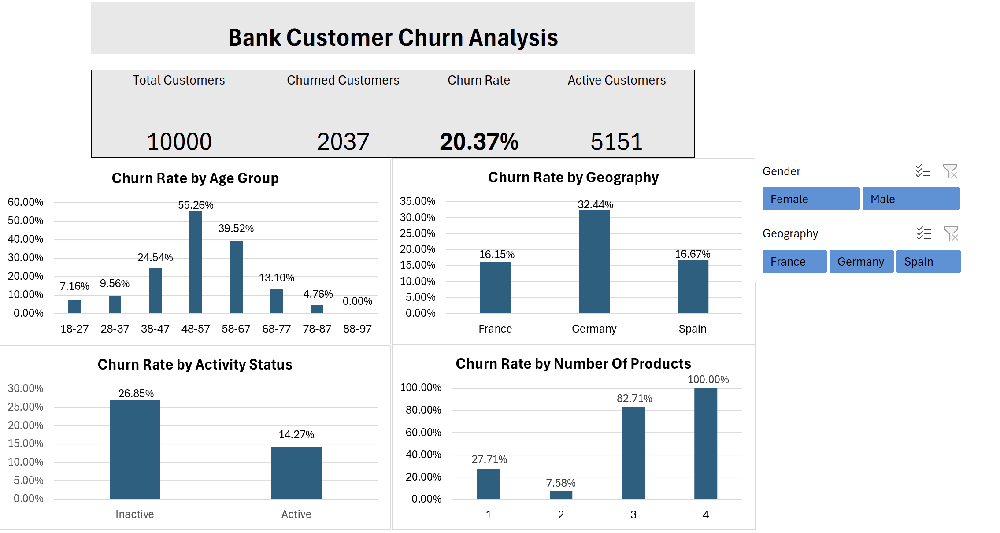

# Bank Customer Churn Analysis 

## Project Overview

This project analyzes customer churn data for a fictitious European bank to identify characteristics associated with customers leaving the bank. Using Microsoft Excel, I cleaned and validated the dataset, analyzed churn across customer segments with PivotTables, and built an interactive dashboard with dynamic KPIs and slicers.

The analysis focuses on identifying high-churn customer segments and translating the findings into actionable insights that could support customer retention strategies.

## Business Objective

The bank wants to better understand which customer segments are most likely to churn and where retention efforts may be most valuable.

This analysis aims to:

- Measure the bank's overall customer churn rate.
- Identify demographic and behavioral characteristics associated with higher churn.
- Compare churn across age groups, geographic markets, activity status, and number of products.
- Identify high-risk customer segments that could be prioritized for retention efforts.
- Build an interactive Excel dashboard that allows users to explore churn patterns by gender and geography.

## Data Dictionary

| Field | Description |
|---|---|
| `CustomerId` | A unique identifier for each customer |
| `Surname` | The customer's last name |
| `CreditScore` | A numerical value representing the customer's credit score |
| `Geography` | The country where the customer resides (France, Spain, or Germany) |
| `Gender` | The customer's gender (Male or Female) |
| `Age` | The customer's age |
| `Tenure` | The number of years the customer has been with the bank |
| `Balance` | The customer's account balance |
| `NumOfProducts` | The number of bank products the customer uses (e.g., savings account, credit card) |
| `HasCrCard` | Whether the customer has a credit card (1 = yes, 0 = no) |
| `IsActiveMember` | Whether the customer is an active member (1 = yes, 0 = no) |
| `EstimatedSalary` | The estimated salary of the customer |
| `Exited` | Whether the customer has churned (1 = yes, 0 = no) |

## Tools & Excel Skills

**Tool:** Microsoft Excel

**Skills demonstrated:**
- Data cleaning and validation
- Excel Tables and structured references
- PivotTables for customer segmentation
- Calculated churn rates using counts and percentages
- Grouping continuous variables such as age, credit score, balance, and salary
- `GETPIVOTDATA` for connecting PivotTable results to dashboard visuals
- Interactive slicers with Report Connections
- Dynamic KPI cards
- Clustered column charts
- Interactive dashboard design

## Analysis

The analysis explored the following questions:

- What is the bank's overall customer churn rate?
- How does churn vary across age groups?
- Do customers in different geographic markets have different churn rates?
- Does customer activity status relate to churn?
- Does the number of bank products a customer holds relate to churn?
- Are credit score, account balance, tenure, salary, or credit-card ownership associated with meaningful differences in churn?
- Which combinations of customer characteristics identify particularly high-churn segments?

## Interactive Dashboard

The final Excel dashboard summarizes the primary churn metrics and allows users to dynamically explore customer segments using **Gender** and **Geography** slicers.

## Key Insights

### Age
Churn varied substantially by age. Customers aged **48–57 had the highest meaningful churn rate at 55.26%**, followed by customers aged **58–67 at 39.52%**. Younger customers experienced considerably lower churn.

### Geography
**Germany had a 32.44% churn rate**, compared with **16.15% in France** and **16.67% in Spain**, making Germany the highest-churn geographic market in the dataset.

### Customer Activity
Inactive customers had a **26.85% churn rate**, compared with **14.27% among active customers**, indicating a strong association between customer engagement and retention.

### Number of Products
Customers with **2 products had the lowest churn rate at 7.58%**, compared with **27.71% among customers with 1 product**. Churn increased sharply to **82.71% for customers with 3 products** and **100% for customers with 4 products**.

The 3- and 4-product segments contained only **266 and 60 customers**, respectively, so these unusually high rates should be interpreted cautiously.

### Other Factors
Credit score, tenure, estimated salary, and credit-card ownership showed relatively little variation in churn rates. Account balance showed some differences, but the relationship was less pronounced than age, geography, activity status, and number of products.

## Business Recommendations

- **Prioritize inactive customers for retention efforts.** Inactive customers experienced substantially higher churn than active customers, making engagement a useful indicator for identifying customers who may need additional outreach.

- **Investigate the elevated churn rate in Germany.** Germany's churn rate was nearly twice that of France and Spain. The bank should examine regional differences in customer experience, pricing, products, and service to determine what may be contributing to this gap.

- **Focus retention efforts on middle-aged customers.** Customers between ages **48–67** experienced some of the highest churn rates, particularly when they were also inactive.

- **Review the experience of customers holding multiple products.** Customers with 3–4 products showed unusually high churn rates. Because these groups have relatively small sample sizes, further investigation is warranted before drawing conclusions or changing product strategy.

- **Use multiple characteristics when identifying high-risk customers.** Rather than relying on a single variable, the bank could combine factors such as age, activity status, geography, and product usage to better prioritize retention efforts.

